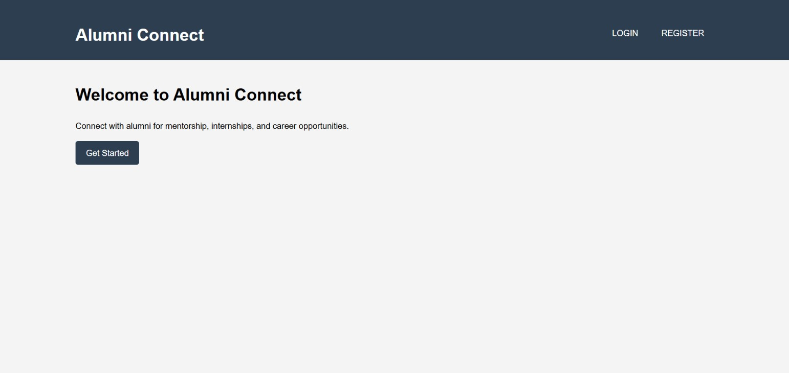
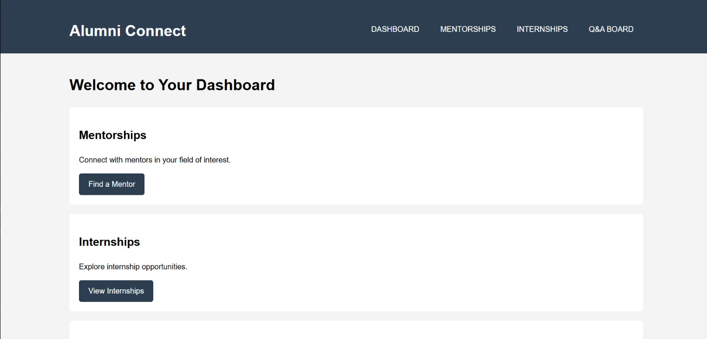

# 🎓 Alumni Connect Portal

A real-time mentorship platform developed during the WLF Hackathon to bridge the gap between students and alumni.

---

## 📌 Overview

The Alumni Connect Portal is a full-stack web application designed to facilitate seamless interaction between current students and alumni mentors. It enables students to:

- Browse a curated list of alumni mentors.  
- Filter mentors based on domain expertise, location, and availability.  
- Apply for mentorship directly through the platform.

Mentor data is dynamically fetched from a live Google Sheet using the Google Sheets API, ensuring real-time updates and easy backend management.

---

## 🚀 Features

✅ Dynamic Mentor Directory (integrated with Google Sheets API)  
🔍 Advanced Filtering (domain, location, availability)  
🧑‍🎓 Student Login & Registration  
💬 Q&A Board (Discussion space for students and mentors)  
🖥️ Clean, Intuitive UI (built for smooth navigation and user experience)

> 🔧 Currently, only the mentorship directory functionality is active and connected to Google Sheets. Other features are present in the UI but not yet functional.

---

## 🛠️ Tech Stack

- **Frontend**: HTML, CSS, JavaScript  
- **Backend**: Python (Flask)  
- **Database/API**: Google Sheets API  
- **Version Control**: Git & GitHub

---

## 📂 Project Structure


```text
├── static/
│ ├── styles.css
│ └── me.png
├── templates/
│ ├── index.html
│ ├── login.html
│ ├── register.html
│ ├── mentorship.html
│ ├── qa_board.html
│ ├── internships.html
│ └── landing.html
├── app.py
└── README.md
```
---
<<<<<<< HEAD
=======

## 🧭 Navigation Guide

1. Login using any credentials (authentication is not implemented).  
2. Upon login, you are redirected to the dashboard.  
3. From the dashboard, navigate to the **Mentorship** section.  
4. Use the available filters to browse mentors, whose data is fetched live from a connected Google Sheet.

---

## 🧭 Navigation Guide

1. Login using any credentials (authentication is not implemented).  
2. Upon login, you are redirected to the dashboard.  
3. From the dashboard, navigate to the **Mentorship** section.  
4. Use the available filters to browse mentors, whose data is fetched live from a connected Google Sheet.

---
## Collaborators
- Yoshitha Maddineni
- Nadimpalli Poorna Shalini

---

## 📸 Hackathon Preview (Screenshots)

### 🔹 Dashboard View  


### 🔹 Mentor Directory with Filters  


### 🔹 Login Page  

